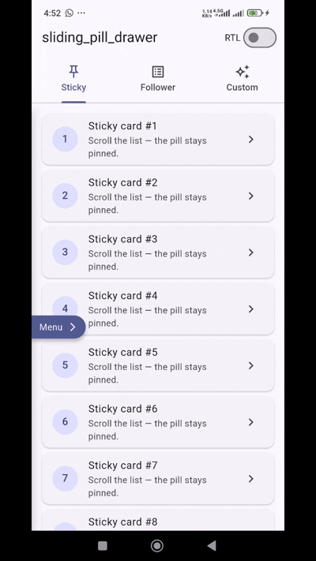
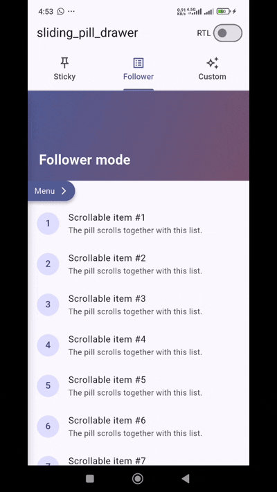
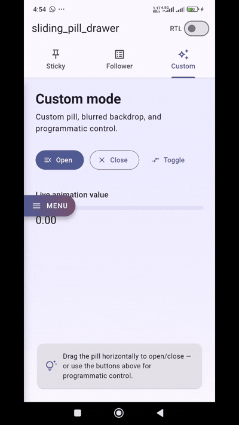
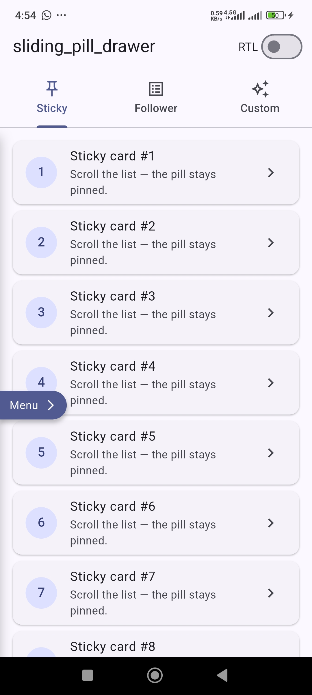
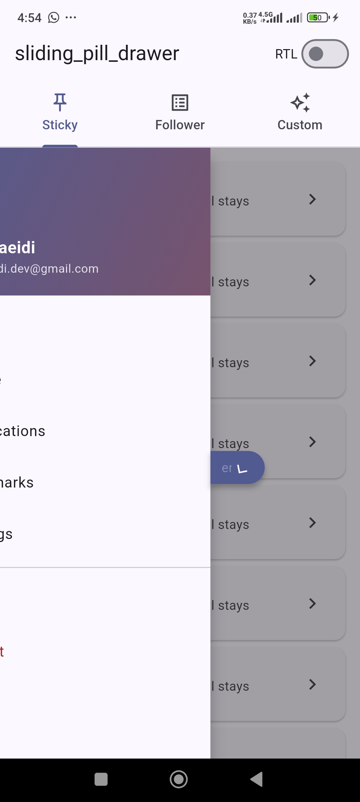
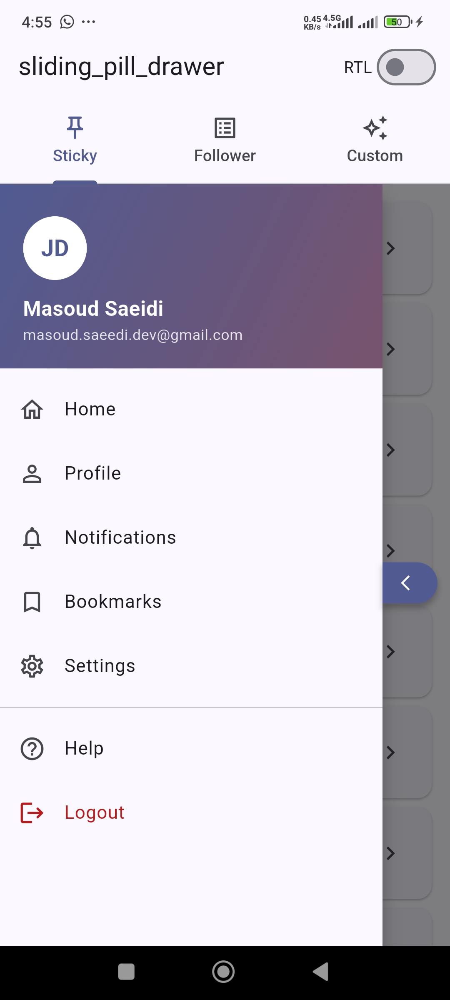

# sliding_pill_drawer

[](https://pub.dev/packages/sliding_pill_drawer)
[](https://pub.dev/packages/sliding_pill_drawer/score)
[](https://pub.dev/packages/sliding_pill_drawer/score)
[](https://pub.dev/packages/sliding_pill_drawer/score)
[](LICENSE)
[](https://pub.dev/packages/flutter_lints)

A customizable side drawer with a draggable **pill** button that slides 1:1 with the panel. Supports a **sticky** pill pinned to the screen, an in-list **follower** pill that rides a `LayerLink`, and full **RTL / LTR** auto-mirroring — with **zero external dependencies**.

## Demo

Three modes, recorded against the [example app](example/):

| Sticky | Follower | Custom |
|:------:|:--------:|:------:|
|  |  |  |

Stills from the example app:

<p align="center">
  
  
  
</p>

## Features

- 🎯 **Two placement modes** — sticky (pinned to a fixed vertical offset) or follower (anchored to a target inside a scrollable).
- 🤝 **1:1 drag coupling** — horizontal drag distance maps directly to panel translation; release snaps based on the halfway point.
- 🌐 **RTL / LTR aware** — panel direction, pill chevron, and target anchor mirror automatically based on `Directionality`.
- 🎨 **Customizable** — supply your own `pillBuilder` and/or `backdropBuilder`, or just override the default pill text.
- 🎛 **Imperative control** — `open` / `close` / `toggle` and a listenable `value` for driving custom animations.
- ⚡ **Zero dependencies** — pure Flutter, no third-party packages, small surface area.

## Table of contents

- [Installation](#installation)
- [Quick start](#quick-start)
- [Usage](#usage)
  - [Sticky mode](#sticky-mode)
  - [Follower mode](#follower-mode)
  - [Custom pill](#custom-pill)
  - [Custom backdrop](#custom-backdrop)
  - [Reading animation progress](#reading-animation-progress)
  - [RTL](#rtl)
- [API reference](#api-reference)
- [Architecture](#architecture)
- [Example app](#example-app)
- [Roadmap](#roadmap)
- [Contributing](#contributing)
- [License](#license)

## Installation

```yaml
dependencies:
  sliding_pill_drawer: ^1.0.1
```

Then:

```dart
import 'package:sliding_pill_drawer/sliding_pill_drawer.dart';
```

## Quick start

```dart
class MyPage extends StatefulWidget {
  const MyPage({super.key});

  @override
  State<MyPage> createState() => _MyPageState();
}

class _MyPageState extends State<MyPage> {
  final _controller = SlidingPillDrawerController();

  @override
  void dispose() {
    _controller.dispose();
    super.dispose();
  }

  @override
  Widget build(BuildContext context) {
    return Scaffold(
      body: SlidingPillDrawer(
        controller: _controller,
        isSticky: true,
        drawerContent: const _Menu(),
        body: const Center(child: Text('Drag the pill →')),
      ),
    );
  }
}
```

## Usage

### Sticky mode

The pill stays pinned at a fixed vertical offset on the screen. Good for global navigation.

```dart
SlidingPillDrawer(
  controller: _controller,
  isSticky: true,
  stickyTop: 200, // pixels from top; defaults to 40% of height
  drawerContent: MyMenu(),
  body: MyPageContent(),
)
```

### Follower mode

The pill rides along a target placed inside the body — perfect when the pill should scroll with a list item.

```dart
final _controller = SlidingPillDrawerController();
final _link = LayerLink();

SlidingPillDrawer(
  controller: _controller,
  link: _link,
  drawerContent: MyMenu(),
  body: ListView(
    children: [
      const Text('…long content…'),
      SlidingPillDrawerTarget(link: _link), // pill appears here and scrolls with the list
      const Text('…more content…'),
    ],
  ),
)
```

### Custom pill

Provide a `pillBuilder` to fully replace the default pill. The supplied `Animation<double>` is `0.0` when closed and `1.0` when fully open.

```dart
SlidingPillDrawer(
  controller: _controller,
  isSticky: true,
  drawerContent: MyMenu(),
  body: MyPage(),
  pillBuilder: (context, animation) => MyOwnPillWidget(animation: animation),
)
```

### Custom backdrop

Replace the default 50% black overlay with anything — gradients, blurs, image tints. Tap-to-close stays wired automatically.

```dart
SlidingPillDrawer(
  controller: _controller,
  isSticky: true,
  drawerContent: MyMenu(),
  body: MyPage(),
  backdropBuilder: (context, animation) => BackdropFilter(
    filter: ImageFilter.blur(
      sigmaX: animation.value * 8,
      sigmaY: animation.value * 8,
    ),
    child: ColoredBox(
      color: Colors.black.withValues(alpha: animation.value * 0.3),
    ),
  ),
)
```

### Reading animation progress

`SlidingPillDrawerController` is a `Listenable`, so you can rebuild any widget against the drawer's animation:

```dart
ListenableBuilder(
  listenable: _controller,
  builder: (context, _) => Opacity(
    opacity: 1 - _controller.value,
    child: Text('${(_controller.value * 100).toStringAsFixed(0)}%'),
  ),
)
```

### RTL

The widget reads from the ambient `Directionality`. Wrap or rely on your app's locale:

```dart
Directionality(
  textDirection: TextDirection.rtl,
  child: SlidingPillDrawer(/* ... */),
)
```

The panel slides in from the right, the pill chevron flips, and the follower target anchors to the right edge — automatically.

## API reference

### `SlidingPillDrawer`

| Parameter | Type | Default | Notes |
|-----------|------|---------|-------|
| `body` | `Widget` | required | Page content behind the drawer. |
| `drawerContent` | `Widget` | required | Panel content. |
| `controller` | `SlidingPillDrawerController` | required | Drives open / close and exposes the animation. |
| `link` | `LayerLink?` | `null` | Required in follower mode; pair with `SlidingPillDrawerTarget`. |
| `isSticky` | `bool` | `false` | `true` = sticky pinned pill, `false` = follower (or no built-in pill if `link` is also null). |
| `stickyTop` | `double?` | 40% of height | Sticky-mode vertical offset, in pixels from the top. |
| `defaultPillText` | `String` | `'Menu'` | Label on the built-in pill. |
| `pillBuilder` | `PillBuilder?` | `null` | Provide your own pill widget. |
| `backdropBuilder` | `BackdropBuilder?` | `null` | Custom backdrop layer; tap-to-close is wired regardless. |
| `overlayBuilder` | `Widget Function(...)` | `null` | Renders extra widgets above backdrop and panel. |
| `panelWidthFraction` | `double` | `0.85` | Fraction of screen width the panel occupies when open. |
| `animationDuration` | `Duration` | `350ms` | Open/close animation length. |

### `SlidingPillDrawerController`

A `ChangeNotifier` — listen to it to rebuild against animation progress.

| Member | Kind | Description |
|--------|------|-------------|
| `value` | `double` getter / setter | `0.0` (closed) … `1.0` (open). Setting clamps to range without animating; pair with `settle()` on drag end. |
| `isOpen` | `bool` getter | `value > 0.5`. |
| `isFullyOpen` | `bool` getter | Animation has finished opening (`value == 1.0`). |
| `open()` / `close()` / `toggle()` | `void` | Animated imperative control. |
| `settle()` | `void` | Snaps fully open or fully closed based on current `value`. Use on drag end of a custom pill. |

### `SlidingPillDrawerTarget`

Used in follower mode only. Reserves the slot where the pill sits inside a scrollable.

```dart
SlidingPillDrawerTarget(link: _link, width: 80, height: 40)
```

| Parameter | Type | Default | Notes |
|-----------|------|---------|-------|
| `link` | `LayerLink` | required | Same instance passed to the parent `SlidingPillDrawer`. |
| `width` | `double` | `80` | Reserved width (≈ pill width). |
| `height` | `double` | `40` | Reserved height (≈ pill height). |

### `DefaultPill`

The built-in pill rendered when `pillBuilder` is omitted. Exported so you can reuse its visual style around a custom layout.

### Typedefs

- `PillBuilder` — `Widget Function(BuildContext, Animation<double>)`
- `BackdropBuilder` — `Widget Function(BuildContext, Animation<double>)`

## Architecture

In **sticky mode**, the pill is positioned imperatively on the leading edge of the panel using `PositionedDirectional`, sliding from `0` to `panelWidth` as the animation progresses.

In **follower mode**, the package uses Flutter's [`LayerLink`](https://api.flutter.dev/flutter/widgets/LayerLink-class.html) primitive. `SlidingPillDrawerTarget` plants a `CompositedTransformTarget` inside the body; the host widget then renders a `CompositedTransformFollower` in a sibling layer that follows the target across scrolls. Drag offset is added on top of the linked position so the pill stays glued to the panel's trailing edge while opening.

For a deeper walk-through, see [`doc/architecture.md`](doc/architecture.md).

## Example app

A runnable demo lives in [`example/`](example/). It wires up all three modes (sticky, follower, custom) and an RTL toggle.

```bash
cd example
flutter run
```

## Roadmap

- [ ] Right-side anchored drawer (mirror the leading-edge default).
- [ ] Configurable snap thresholds (currently fixed at 50%).
- [ ] Velocity-aware fling open/close.

Have an idea? File it under [issues](https://github.com/masoudcoder/sliding_pill_drawer/issues).

## Contributing

PRs welcome. See [`CONTRIBUTING.md`](CONTRIBUTING.md) for setup, branching, commit, and test expectations. By participating you agree to the [Code of Conduct](CODE_OF_CONDUCT.md).

## License

MIT © [Masoud Saeidi](mailto:masoud.saeedi.dev@gmail.com) — see [`LICENSE`](LICENSE).
